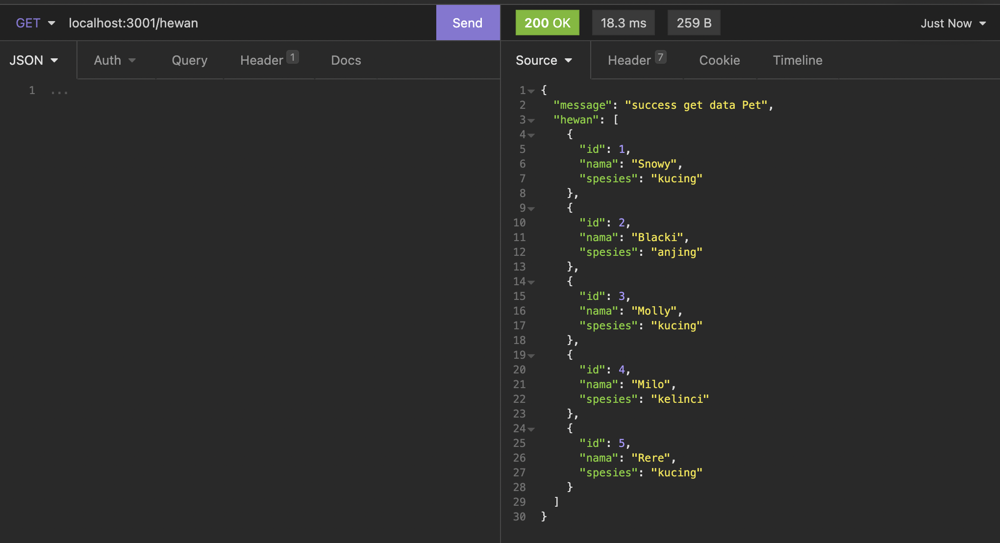
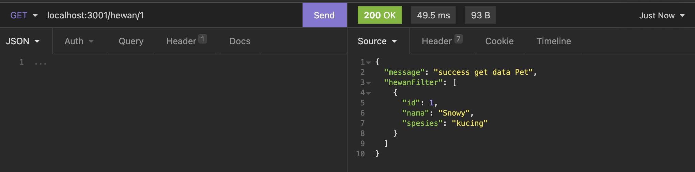
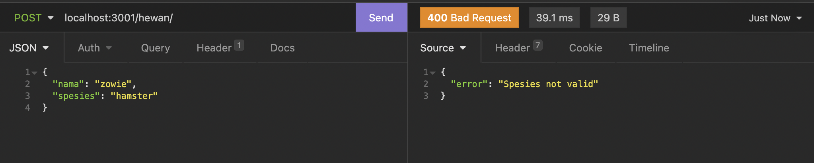

## Description
Buatlah sebuah aplikasi express untuk aplikasi pencatatan nama nama hewan yang bisa melakukan operasi CRUD(Create Read Update Delete) dengan menggunakan Middleware.

## Specs
Kita akan membuat dahulu beberapa route berdasarkan dari method GET, POST, PUT dan DELETE.

Buatlah dahulu sebuah Array JavaScript yang berisi nama dan spesies hewan apa seperti contoh dibawah. 

``` js
const hewan = [
  {id: 1, nama: 'Snowy', spesies: 'kucing'},
  {id: 2, nama: 'Blacki', spesies: 'anjing'},
  {id: 3, nama: 'Molly', spesies: 'kucing'},
  {id: 4, nama: 'Milo', spesies: 'kelinci'},
  {id: 5, nama: 'Rere', spesies: 'kucing'},
]
```
### Soal - 01
Dari Array diatas lakukan operasi berikut
### GET '/hewan'
  - Route ini digunakan untuk mengembalikan keselurahan data Array 

### POST '/hewan' 
  - Route ini digunakan untuk menerima sebuah Form Data dan akan memasukannya kedalam Array 'hewan'
  - Ketika data sudah berhasil ditambahkan kirimkan sebuah respond untuk memberitahukan datanya sudah bertambah
  
### GET '/hewan/:id'
  - Route ini digunakan untuk mengambil hanya satu data saja sesuai dengan ID yang direquest melalui query

### PUT '/hewan/:id'
  - Route ini digunakan untuk merubah / update hanya satu data saja sesuai dengan ID yang direquest melalui query
  - Ketika merubah masukan juga Form Data berisi data terbaru
  - Ketika data sudah berhasil diubah kirimkan sebuah respond untuk memberitahukan datanya sudah berubah

### DELETE '/hewan/:id'
  - Route ini digunakan untuk menghapus hanya satu data saja sesuai dengan ID yang direquest melalui query.
  - Ketika data sudah berhasil dihapus kirimkan sebuah respond untuk memberitahukan datanya sudah terhapus

## Middleware
### Soal - 02

Ketika sudah berhasil membuat semua routes kita akan membuat middleware 

- Middleware Logger
  - Buatlah sebuah middleware function yang berguna untuk melakukan `console.log` log untuk mengetahui middleware logger berjalan
  - Aplikasikan Middleware Logger pada seluruh endpoint / route

- Middleware Post Checker
  - Buatlah sebuah middleware function yang bergunaa untuk melakukan checking apakah Form Data yang dikirimkan memiliki 'spesies' kucing, anjing atau kelinci. Jika tidak kembalikan dengan status code 400.
  - Aplikasikan Middleware Post Checker pada '/post' endpoint / route saja

## Expected Result
1. Soal - 01
  - Get ALL
  
  - Get by ID
  
  - Post
  

2. Soal - 02
  - Middleware Logger
  
  - Middleware Post Checker
  