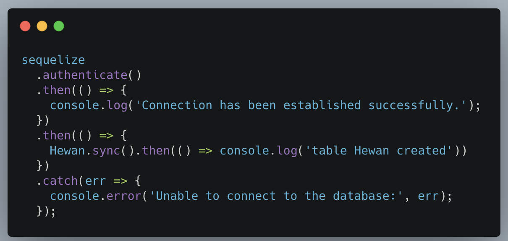
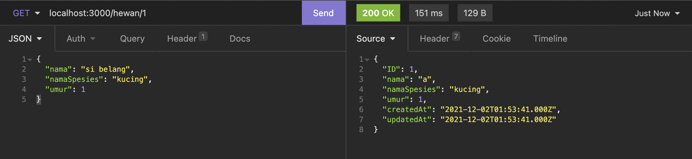

## Description
Buatlah sebuah aplikasi express dengan menggunakan database mysql dan menggunakan ORM Sequelize hingga bisa melakukan operasi CRUD(Create Read Update Delete)

## Specs
Kita akan membuat aplikasi express dari awal membuat koneksi hingga bisa melakukan operasi CRUD(Create Read Update Delete) dengan menggunakan ORM Sequelize

### Buatlah sebuah koneksi 
### Soal - 01 

Koneksikan aplikasi express kita menggunakan ORM Sequlize hingga berhasil tersambung dengan database mysql dan lakukan sync untuk membuat table Hewan
- 

### Soal - 02

- Buatlah model dari table Hewan dengan attribute
  - ID
    - data type: INTEGER,
    - PK: true,
    - allowNull: false,
    - autoIncrement: true,
  
  - nama
    - dataTypes: string,
    - allowNull: false,
  
  - namaSpesies
    - dataTypes: string,
    - allowNull: false,
  
  - umur
    - dataTypes: integer,
    - allowNull: false,

### Soal - 03    
- Melakukan operasi sederhana menggunakan sequelize

- GET All '/hewan'
  - Buatlah sebuah endpoint / route yang berguna untuk menampilkan semua data dari table Hewan menggunakan ORM Sequlize '.findAll()'

- GET By ID '/hewan'
  - Buatlah sebuah endpoint / route yang berguna untuk menampilkan data dari table Hewan menggunakan ORM Sequlize '.findById()' berdasarkan  ID yang dikirimkan melalui query

- POST '/hewan'
  - Buatlah sebuah endpoint / route yang berguna untuk menambahkan data dari table Hewan menggunakan ORM Sequlize '.create()'
  
- UPDATE by ID '/hewan'
  - Buatlah sebuah endpoint / route yang berguna untuk mengupdate data dari table Hewan menggunakan ORM Sequlize '.update()' berdasarkan  ID yang dikirimkan melalui query
  
- DELETE '/hewan'
  - Buatlah sebuah endpoint / route yang berguna untuk menghapus data dari table Hewan menggunakan ORM Sequlize '.destroy()' berdasarkan  ID yang dikirimkan melalui query

## Expected Result
1. Soal - 01

  - 

2. Soal - 02

  - 

3. Soal - 03

  - 
  - 
  - 
  - 
  - 