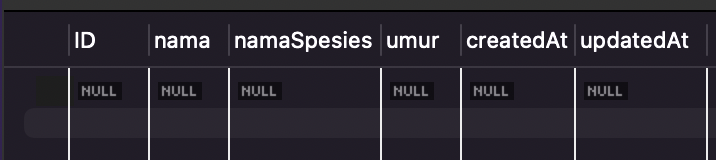
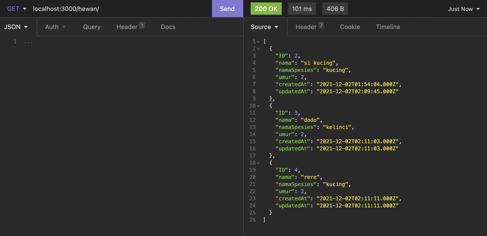
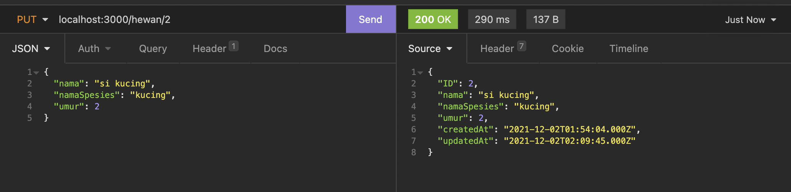

## Description
Buatlah sebuah aplikasi express dengan menggunakan database MySQL dan menggunakan ORM Sequelize hingga bisa melakukan operasi CRUD(Create Read Update Delete)

## Specs
Kita akan membuat aplikasi express dari awal membuat koneksi hingga bisa melakukan operasi CRUD(Create Read Update Delete) dengan menggunakan ORM `Sequelize`

### Buatlah sebuah koneksi 
### Soal - 01 

Koneksikan aplikasi express kita menggunakan ORM Sequlize hingga berhasil tersambung dengan database MySQL dan lakukan sync untuk membuat table Hewan

### Soal - 02

- Buatlah model dari table `hewan` dengan attribute
  - `id`
    - data type: INTEGER,
    - PK: true,
    - allowNull: false,
    - autoIncrement: true,
  
  - `nama`
    - dataTypes: string,
    - allowNull: false,
  
  - `namaSpesies`
    - dataTypes: string,
    - allowNull: false,
  
  - `umur`
    - dataTypes: integer,
    - allowNull: false,

### Soal - 03    
- Melakukan operasi sederhana menggunakan `sequelize`

- `GET` All `/hewan`
  - Buatlah sebuah endpoint yang berguna untuk menampilkan semua data dari table Hewan menggunakan ORM Sequlize `.findAll()`

- `GET` by id `/hewan`
  - Buatlah sebuah endpoint yang berguna untuk menampilkan data dari table `hewan` menggunakan ORM Sequelize `.findById()` berdasarkan  `id` yang dikirimkan melalui query

- `POST` `/hewan`
  - Buatlah sebuah endpoint yang berguna untuk menambahkan data dari table `hewan` menggunakan ORM Sequelize `.create()`
  
- `UPDATE` by id `/hewan`
  - Buatlah sebuah endpoint yang berguna untuk mengupdate data dari table `hewan` menggunakan ORM Sequelize `.update()` berdasarkan  `id` yang dikirimkan melalui query
  
- `DELETE` `/hewan`
  - Buatlah sebuah endpoint yang berguna untuk menghapus data dari table `hewan` menggunakan ORM Sequlize `.destroy()` berdasarkan  `id` yang dikirimkan melalui query

## Expected Result
1. Soal - 01

  - 

2. Soal - 02

  - 

3. Soal - 03

  - 
  - 
  - 
  - 
  - 