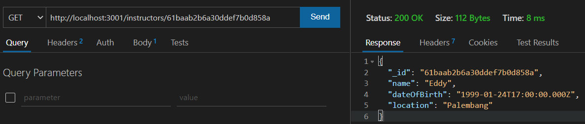
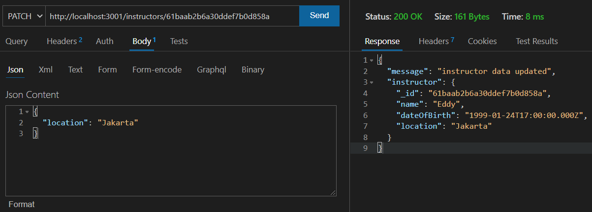
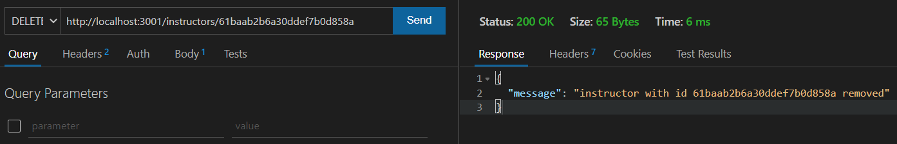

# **Build Web Service and RESTful API with ExpressJs & Mongoose**


## Objective

Pada tugas kali ini, kamu akan diharapkan untuk membuat RESTful API yang bisa melakukan CRUD ke MongoDB dengan menggunakan ODM Mongoose. Selain itu diharapkan juga kamu bisa lebih mengerti use case perancangan Schema Object sesuai dengan kebutuhan.

- [ ] Students mampu membuat RESTful API dengan menggunakan ExpressJS.
- [ ] Students mampu mengkonfigurasi ODM Mongoose.
- [ ] Students mampu membuat rancangan Schema Mongoose sesuai dengan kebutuhan.
- [ ] Students mampu membuat CRUD dengan menggunakan Mongoose.


## Deskripsi

Pada project kali ini, kamu akan diminta membuat beberapa endpoint RESTful API yang akan melakukan proses CRUD kedalam database MongoDB untuk sebuah project **Online Courses Website** dengan menggunakan ODM Mongoose. Project ini akan menggunakan beberapa collection dengan spesifikasi requirement untuk tiap-tiap collection akan di jelaskan lebih detail pada keterangan selanjutnya.

## Collection Spesification 

Diberikan requirement untuk tiap-tiap collection sebagai berikut :

- **<u>Instructors Collection</u>**

  Collection ini berisikan informasi mengenai instruktur pada suatu kelas. Informasi yang akan disimpan dalam collection ini berupa **name, dateOfBirth, location**.

  | Key         | Data Type | Note                                           |
  | ----------- | --------- | ---------------------------------------------- |
  | name        | string    | required, min 1 character , max 100 characters |
  | dateOfBirth | date      | required                                       |
  | Location    | string    | not required                                   |

  

- **<u>Courses Collection</u>**

  Collection ini berisikan informasi mengenai course, informasi yang akan disimpan dalam collection ini berupa **title, description, instructor, scheduleDateTime**

  | Key              | Data Type              | Note                                          |
  | ---------------- | ---------------------- | --------------------------------------------- |
  | title            | string                 | required, min 1 character, max 50 characters  |
  | description      | string                 | required, min 1 character, max 500 characters |
  | instructor       | objectId of instructor | required                                      |
  | scheduleDateTime | date                   | required                                      |

  

- **<u>Participants Collection</u>**

  Collection ini berisikan informasi mengenai participant yang ikut serta pada courses, informasi yang akan disimpan dalam collection ini berupa **name, dateOfBirth, email, phone, courses**

  | Key         | Data Type                 | Note                                         |
  | ----------- | ------------------------- | -------------------------------------------- |
  | name        | string                    | required, min 1 character, max 50 characters |
  | dateOfBirth | date                      | required                                     |
  | email       | string                    | not required, max 50 characters              |
  | phone       | phone                     | not required max 13 characters               |
  | courses     | array of courses objectId |                                              |

  

## Soal - 01

Setuplah sebuah **ExpressJS Application** yang siap digunakan untuk membuat sebuah **RESTful API** dan akan terkoneksi dengan database **MongoDB**. Pastikan service database MongoDB yang kamu gunakan sedang running dan aplikasi yang kamu setup bisa terkoneksi ke database.

> NOTE: Disarankan menggunakan [MongoDB Atlas](https://www.mongodb.com/atlas/database) agar aplikasi bisa di deploy online


 ## Soal - 02

Buatlah schema dan model untuk masing-masing collection (**Instructors collection, Courses Collection, Participants Collection**). Schema ini harus dilengkapi dengan tipe data yang tepat dan menggunakan validation yang tepat sesuai dengan requirement dari tiap-tiap collections.

 

 ## Soal - 03

Buatlah Router dan Controller untuk menghandle proses CRUD pada tiap-tiap collection (**Instructors collection, Courses Collection, Participants Collection**) dengan spesifikasi sebagai berikut :

- **Pisahkan Router berdasarkan resource kedalam 1 folder routes. Tiap-tiap Router dibuat didalam 1 buah file.**
- **Pisahkan function handler berdasarkan resource kedalam 1 folder controllers. Tiap-tiap Handler dibuat dalam 1 buah file.**
- **Ketika melakukan get data dari collection (GET ALL ataupun GET DETAIL), harus melakukan populate ke schema dan model yang saling terkait dengan objectId.**
- **Harus sesuai dengan kaidah RESTful API.** 
  - Format URL harus sesuai.

  - HTTP Method yang digunakan harus sesuai.

  - HTTP Response Status Code yang digunakan harus sesuai

``` 
    Refferences:
    https://restfulapi.net/rest-api-design-tutorial-with-example/
    https://restfulapi.net/http-methods/
    https://restfulapi.net/rest-put-vs-post/
    https://restfulapi.net/http-status-codes/
```


## Soal - 04

Setelah Application kamu jadi, saatnya untuk deploy ke online dan membuat dokumentasi. Silahkan deploy aplikasi kamu ke [Heroku](https://www.heroku.com/) dan buatlah juga [Postman online documentation](https://www.postman.com/api-documentation-tool/). Pastikan aplikasi kamu sudah sesuai dengan requirement dan pastikan juga validation pada mongoose berjalan dengan baik.

------

## Expected Results

Berikut adalah beberapa expected results (hanya sebagian contoh) :

- Endpoint Instructor

  - Ketika Create Instructor
    
  
  - Ketika Get All Instructor
    
    
  - Ketika Get Instructor Detail By Id
    
    
  - Ketika Edit Instructor
    
    
  - Ketika Delete Instructor
    